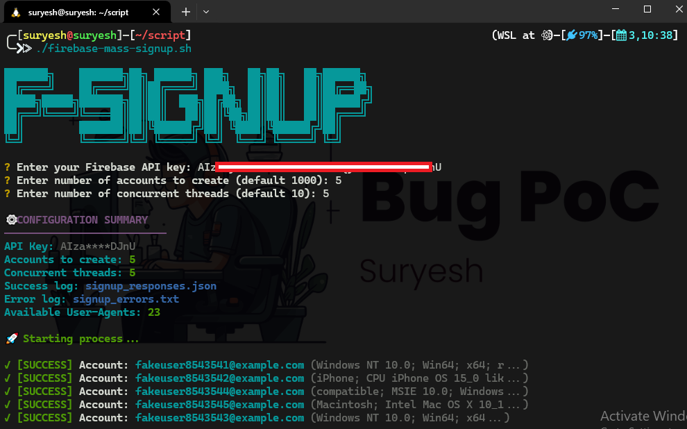

# Uses

1. Git Clone
```
https://github.com/Suryesh/firebase-account-signup
```

2. Go to Script Directory

```
cd firebase-account-signup
```

4. Give executable permission
```
chmod +x firebase-mass-signup.sh
```

5. Now Run it

```
bash firebase-mass-signup.sh
```

or,

```
./firebase-mass-signup.sh
```

6. Now enter Firebase API Key
7. Other things you can leave it as default or you can give value according to you.



